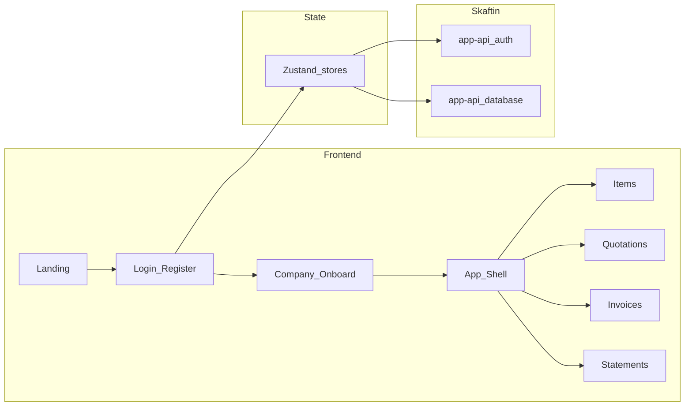

# Foroman — Implementation Plan

ERP-like app: landing, auth, optional company onboarding, items (products), quotations, invoices (with PDF/download/send), and customer statements. Tech: Zustand, React Hot Toast, Skaftin (SuperTokens-based app-user auth).

---

## Current state

- **Stack:** React 19, Vite (rolldown), TypeScript, Tailwind 4. Existing hash-based routing and invoice list/form/detail wired to Skaftin backend via `src/backend/client/SkaftinClient.ts`.
- **Backend:** Skaftin platform (API key in `.env`) with app-api: database tables, and **app-user auth** (SuperTokens) at `/app-api/auth` (register, login, session JWT). See `client-sdk/07-APP-USER-AUTHENTICATION.md` and `client-sdk/requests/01-AUTH-REQUESTS.md`.
- **Gap:** No landing/login/register, no company/items/quotations/statements, no proper router or global state/toasts.

## Architecture (high level)

- **Auth:** Use Skaftin’s app-user auth (SuperTokens). Call `POST /app-api/auth/register` and `POST /app-api/auth/login`; store `user` + `session.accessToken` in a Zustand auth store; pass JWT in `SkaftinClient` (replace the placeholder `useAuthStore` in `SkaftinClient.ts` with the real store).
- **Data:** All persistent data (companies, items, quotations, invoices, statement data) via Skaftin app-api database tables (same pattern as existing `invoiceService.ts`). Backend tables/schema are assumed to exist or be created in Skaftin.
- **Docs:** This `docs/` folder holds product/architecture and feature docs; `client-sdk/` remains the Skaftin API reference.

## Tech stack (additions)

| Area   | Choice              | Notes                                                                 |
|--------|---------------------|-----------------------------------------------------------------------|
| Routing| `react-router-dom`  | Replace hash routing with `/`, `/login`, `/register`, `/onboard`, `/app/*`. |
| State  | Zustand             | Stores: auth (user, token), company (current), optional cache/slices. |
| Toasts | React Hot Toast     | Wrap app in `Toaster`; use for success/error on auth, CRUD, email, PDF. |
| Auth   | SuperTokens (Skaftin)| Use Skaftin auth endpoints + Zustand session; no extra SuperTokens SDK. |

## Feature breakdown

### 1. Public shell and auth

- **Landing page (`/`):** Marketing-style landing with CTA to Login / Register. No auth required.
- **Login (`/login`):** Form → `POST /app-api/auth/login` (email + password, `method: "email"`). On success: set session in auth store, redirect to `/app` (or `/onboard` if no company).
- **Register (`/register`):** Form → `POST /app-api/auth/register` (name, email, password, etc.). On success: set session, then redirect to company onboarding (or skip).

### 2. Company onboarding (optional, skippable)

- **Route:** e.g. `/onboard`. Shown after first register (or when user has no company).
- **Form:** Company name, address, tax ID, logo (optional), etc. Save to Skaftin table e.g. `companies` (linked to user via `user_id`). “Skip for now” → redirect to `/app`; allow entering/editing company later from settings/dashboard.

### 3. App shell (protected)

- **Route:** `/app` and nested `/app/items`, `/app/quotations`, `/app/invoices`, `/app/statements`. Layout: sidebar or top nav (Items, Quotations, Invoices, Statements, Company/Settings, Logout).
- **Guard:** If no valid session (Zustand auth store), redirect to `/login`. Use same JWT in `SkaftinClient` for all app-api calls.

### 4. Items (products) management

- **Screen:** List and CRUD for items (products). Fields: name, SKU, description, unit price, tax rate, etc. Persist in Skaftin table e.g. `items` or `products`.
- **Use in invoices/quotations:** Invoice and quotation forms allow selecting from these items and adding lines (quantity, unit price, total); optionally auto-fill price from item.

### 5. Invoices (extend current)

- **Keep:** List, create, edit, detail views; use Skaftin `invoices` (+ `invoice_items`) and existing service pattern.
- **Enhance:**
  - **Products:** Invoice lines reference app items (products); dropdown or search to add by item (prefill price).
  - **Download:** “Download PDF” button → generate PDF (e.g. `@react-pdf/renderer` or backend endpoint) and trigger download.
  - **Send:** “Send invoice” → call Skaftin communications or custom endpoint to email PDF/link to `customer_email`; show success/error toast.

### 6. Quotations

- **New entity:** Table `quotations` (customer, dates, status, totals) and `quotation_lines` (product/item, qty, price). Same UX pattern as invoices: list, create, edit, detail.
- **Convert to invoice:** “Convert to invoice” on quotation detail → create an invoice from quotation (copy header + lines), then redirect to new invoice or show success + link. Optionally mark quotation as “converted” and link to invoice id.

### 7. Customer statements

- **Screen:** Select customer (from `customers` table or derived from invoices/quotations), date range, then “Generate statement”. Statement = list of invoices/quotations and payments (if payment data exists) with running balance.
- **Output:** Display on screen and “Download PDF” (and optionally “Send by email”). Data fetched via Skaftin (invoices by customer + date range; payments if table exists).

### 8. Documentation

- **`docs/architecture.md`:** High-level architecture, data flow, where SuperTokens fits.
- **`docs/features.md`:** List of features with short description and main user flows.
- **`docs/setup.md`:** Env vars (`VITE_SKAFTIN_*`), how to run dev/build, backend (tables) on Skaftin.

## File / structure changes

- **New:** `docs/architecture.md`, `docs/features.md`, `docs/setup.md`.
- **New:** `src/stores/authStore.ts` (Zustand: user, accessToken, setSession, logout).
- **New:** `src/stores/companyStore.ts` (optional: current company, setCompany, load from API).
- **New:** `src/services/authService.ts` (register, login using Skaftin auth endpoints).
- **New:** `src/pages/Landing.tsx`, `Login.tsx`, `Register.tsx`, `Onboard.tsx` (company form + skip).
- **New:** `src/pages/app/` or `src/layouts/AppLayout.tsx` + routes: Items, Quotations, Invoices, Statements; reuse/refactor existing `InvoiceList`, `InvoiceForm`, `InvoiceDetail` under app routes.
- **New:** `src/pages/app/Items.tsx` (list + CRUD), `Quotations.tsx`, `Statements.tsx`.
- **New:** Quotation types, service, and “convert to invoice” logic; statement data fetching and PDF/email.
- **Refactor:** `App.tsx` → React Router routes (landing, login, register, onboard, `/app/*` with layout); wrap app in `<Toaster />` and use auth store for redirects.
- **Refactor:** `SkaftinClient.ts` — replace placeholder `useAuthStore` with real Zustand auth store so JWT is sent in requests.
- **Dependencies:** Add `react-router-dom`, `zustand`, `react-hot-toast`. Optional: `@react-pdf/renderer` for PDF generation.

## Data model assumptions (Skaftin)

- **companies:** id, user_id (or app_user_id), name, address, tax_id, logo_url, created_at, updated_at.
- **items (products):** id, company_id (optional), name, sku, description, unit_price, tax_rate, created_at, updated_at.
- **quotations:** id, company_id, customer_*, issue_date, valid_until, status, subtotal, tax, total, created_at, updated_at.
- **quotation_lines:** id, quotation_id, item_id, description, quantity, unit_price, total.
- **invoices:** (existing) extend with company_id if multi-tenant; invoice_items already exist.
- **customers:** id, company_id, name, email, address. Used for statements.

Tables can be created in Skaftin UI or via migrations; frontend will assume these table/column names or adapt to actual schema.

## Order of implementation

1. **Dependencies and routing** — Add react-router-dom, zustand, react-hot-toast; create router and route list (landing, login, register, onboard, /app/*).
2. **Auth** — authStore (Zustand), authService (register/login), wire SkaftinClient to auth store; Login/Register pages and redirect logic.
3. **Landing and onboarding** — Landing page; Onboard page (company form + skip); optional companyStore.
4. **App shell** — Protected layout for /app with nav; redirect when unauthenticated.
5. **Items** — Types, service, Items page (list + CRUD).
6. **Invoices (enhance)** — Move under /app; link to items; add Download PDF and Send; integrate toasts.
7. **Quotations** — Types, service, list/form/detail; “Convert to invoice” action.
8. **Statements** — Customers list or selector, date range, fetch data, statement view, Download PDF and optional Send.
9. **Docs** — architecture.md, features.md, setup.md in `docs/`.

## Out of scope (for later)

- Self-hosted SuperTokens (using Skaftin’s built-in auth only).
- Payment recording and running balance in statements (add when payment table exists).
- Multi-tenancy beyond company_id (single company per user for now).
